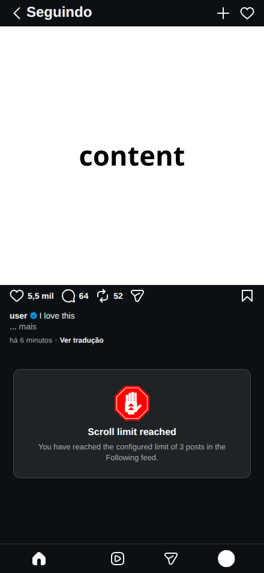
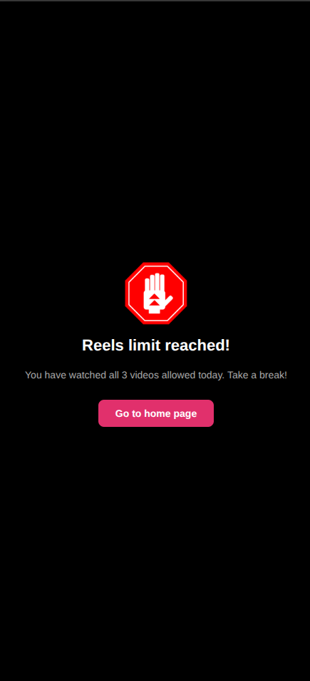
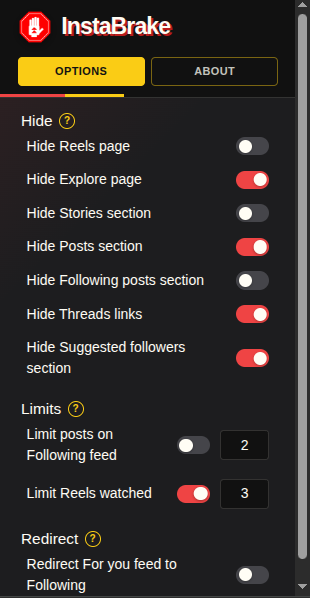

# InstaBrake

## Contents

- [English](#english)
  - [Features](#features)
  - [Development](#development)
  - [Manual installation](#manual-installation)
  - [Release package](#release-package)
  - [Configuration](#configuration)
  - [Privacy](#privacy)
- [Português](#português)
  - [Recursos](#recursos)
  - [Desenvolvimento](#desenvolvimento)
  - [Instalação manual](#instalação-manual)
  - [Pacote de release](#pacote-de-release)
  - [Configuração](#configuração)
  - [Privacidade](#privacidade)

## English

InstaBrake is a Chromium extension that helps reduce distractions on Instagram by hiding specific sections, controlling the feed, and limiting Reels consumption.

### Features

- Limit the number of posts displayed in the Following feed.
- Set a daily limit for watched Reels.
- Hide the Reels page.
- Hide the Explore page.
- Hide the Stories section.
- Hide the For You feed.
- Hide the Following feed.
- Hide Threads links.
- Hide suggested followers.
- Redirect the home page to the Following feed.

#### Examples

| Limit posts on the Following feed                          | Daily Reels limit                                                                         |
| ---------------------------------------------------------- | ----------------------------------------------------------------------------------------- |
|  |  |

### Development

The source code is organized in ES modules under `modules/`. The content script is bundled with Vite because Manifest V3 content scripts must be loaded as classic scripts.

Install the development dependencies and generate the bundle with:

```bash
npm install
npm run build
```

The build creates `dist/content.js`, which is required by `manifest.json`. The `dist/` directory is intentionally ignored by Git because it is a generated release artifact.

### Manual installation

For manual installation, download the ZIP attached to the latest GitHub Release. Do not use the source-code ZIP unless you build the extension first.

1. Download and extract the release ZIP.
2. Open the extensions page in a Chromium-based browser.
3. Enable **Developer mode**.
4. Click **Load unpacked**.
5. Select the extracted folder containing `manifest.json`.
6. Open Instagram and configure the extension through the options popup.

The release ZIP already contains the generated content script, so Node.js is not required for manual installation.

### Release package

The release ZIP must contain the generated `dist/content.js` and all runtime files referenced by `manifest.json`. Creating a ZIP locally does not create a GitHub Release or run automatically after every commit. A new Release is created only when it is published manually or through a configured GitHub Actions workflow.

### Configuration

Open the extension popup to configure which sections should be hidden and set usage limits. Options are saved automatically.



Numeric limits accept values between `1` and `500`. The default values are:

| Option                    | Default |
| ------------------------- | ------- |
| Hide Explore              | Enabled |
| Hide For You feed         | Enabled |
| Hide suggested followers  | Enabled |
| Hide Threads links        | Enabled |
| Limit Reels watched       | Enabled |
| Reels limit               | 10      |
| Following feed post limit | 10      |

### Privacy

InstaBrake does not collect, track, or send browsing data. The extension only uses the `storage` permission to save the preferences configured by the user.

The daily Reels control uses the Instagram page's local storage to keep track of the daily count. No data is sent to external servers.

## Português

O InstaBrake é uma extensão para Chromium que ajuda a reduzir distrações no Instagram, ocultando seções específicas, controlando o feed e limitando o consumo de Reels.

### Recursos

- Limitar a quantidade de publicações exibidas no feed “Seguindo”.
- Limitar a quantidade diária de Reels assistidos.
- Ocultar a página de Reels.
- Ocultar a página Explorar.
- Ocultar a seção de Stories.
- Ocultar o feed “Para Você”.
- Ocultar o feed “Seguindo”.
- Ocultar links do Threads.
- Ocultar sugestões de seguidores.
- Redirecionar a página inicial para o feed “Seguindo”.

#### Exemplos

| Limite de publicações no feed “Seguindo”                            | Limite diário de Reels                                                                             |
| ------------------------------------------------------------------- | -------------------------------------------------------------------------------------------------- |
|  |  |

### Desenvolvimento

O código-fonte é organizado em módulos ES na pasta `modules/`. O content script é compilado com Vite porque os content scripts do Manifest V3 precisam ser carregados como scripts clássicos.

Instale as dependências de desenvolvimento e gere o bundle com:

```bash
npm install
npm run build
```

O build cria `dist/content.js`, que é necessário porque o `manifest.json` aponta para esse arquivo. A pasta `dist/` é ignorada pelo Git de propósito, pois é um artefato gerado para distribuição.

### Instalação manual

Para instalar manualmente, baixe o ZIP anexado à última GitHub Release. Não use o ZIP do código-fonte sem antes gerar o build.

1. Baixe e extraia o ZIP da release.
2. Abra a página de extensões de um navegador baseado em Chromium.
3. Ative o **Modo do desenvolvedor**.
4. Clique em **Carregar sem compactação**.
5. Selecione a pasta extraída que contém o `manifest.json`.
6. Abra o Instagram e configure a extensão pelo popup de opções.

O ZIP da release já contém o content script compilado, portanto o Node.js não é necessário para a instalação manual.

### Pacote de release

O ZIP da release deve conter o `dist/content.js` gerado e todos os arquivos de runtime referenciados pelo `manifest.json`. Criar um ZIP localmente não cria uma GitHub Release nem executa automaticamente após cada commit. Uma nova release só é criada quando publicada manualmente ou por meio de um workflow do GitHub Actions configurado para isso.

### Configuração

Abra o popup da extensão para configurar as seções que devem ser ocultadas e os limites de uso. As opções são salvas automaticamente.


Os limites numéricos aceitam valores entre `1` e `500`. Os valores padrão são:

| Opção                                    | Padrão  |
| ---------------------------------------- | ------- |
| Ocultar Explorar                         | Ativado |
| Ocultar feed “Para Você”                 | Ativado |
| Ocultar sugestões de seguidores          | Ativado |
| Ocultar links do Threads                 | Ativado |
| Limitar Reels assistidos                 | Ativado |
| Limite de Reels                          | 10      |
| Limite de publicações no feed “Seguindo” | 10      |

### Privacidade

O InstaBrake não coleta, rastreia ou envia dados de navegação. A extensão usa apenas a permissão `storage` para salvar as preferências configuradas pelo usuário.

O controle diário de Reels utiliza o armazenamento local da página do Instagram para manter a contagem do dia. Nenhum dado é enviado para servidores externos.
